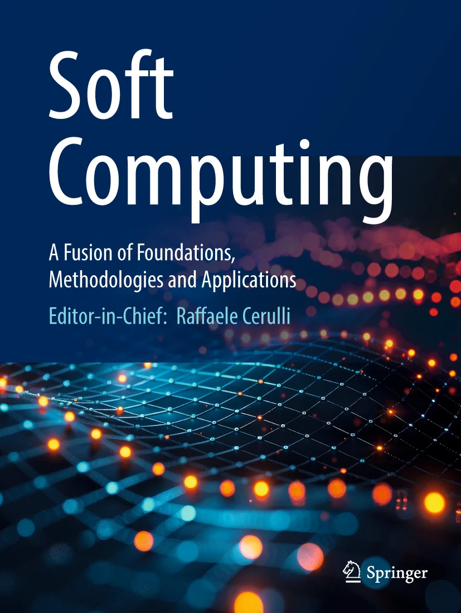

## Soft Computing

####   Article: <small><strong>A New Perspective on Centroid Algorithms for Unsupervised Discrete Clustering on Riemannian Manifolds: An Approach via Image Optimization</strong> <a href="#"></a> <a href="#"></a> <a href="https://drive.google.com/drive/folders/1n6mCdPr8d3aBxoBhlOxMItlt1YM0Dxqu?usp=sharing"></a></small>

We present a computational study of unsupervised discrete clustering applied to diffusion tensor MRI (DT-MRI) volumes. Each voxel is represented by a 3 × 3 symmetric positive definite (SPD) matrix, and clustering is performed on SPD(3), using Euclidean and Log-Euclidean vectorizations, or through the Grassmannian representation induced by the principal diffusion direction. The repository implements generalized *k*-centroids (GKAC), adaptive generalized *k*-centroids (AGKaC), manifold Gaussian mixture models (GMM), and spectral clustering.

The evaluation organizes 20 DT-MRI tensor volumes into five volume-wise folds and uses five random seeds, three clusters, configurable restarts, and a unified experimental design. GKAC is evaluated using fixed α values corresponding to median-like, mean-like, and minimax centroids, whereas AGKaC estimates a cluster-specific α from the skewness and kurtosis of tangent-space coordinates. The methods are evaluated under Euclidean vectorization, SPD Frobenius, Log-Euclidean, affine-invariant Riemannian (AIRM), and Grassmannian geometries.

Predicted clusters are aligned with the reference segmentation through Hungarian assignment and evaluated using IoU, Dice, Precision, Recall, and Accuracy. The repository exports NIfTI segmentations, per-run and aggregate CSV metrics, objective values, iteration counts, empty-cluster records, execution times, α trajectories, centroid evolution, and sagittal, coronal, and axial figures. Separate runners support full-volume and slice-wise clustering using NumPy/SciPy on CPU, with an optional PyTorch CUDA backend.

#### Dependencies

* Python >= 3.12
* numpy
* scipy
* scikit-learn
* nibabel
* matplotlib
* torch (optional; required for CUDA)

#### Bash

```bash
pip install numpy scipy scikit-learn nibabel matplotlib torch
```

#### License (MIT)

* Copyright (c) alancampos-ai
* Code released under the MIT License.
