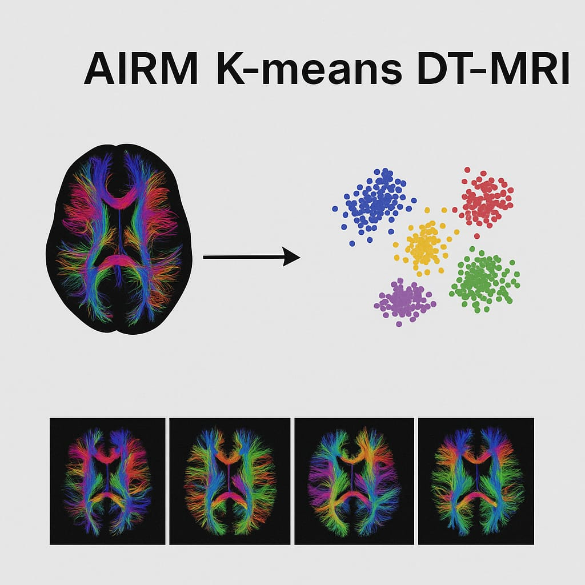

# airm-gmm-dti 
DTI-MRI segmentation via Riemannian Gaussian Mixture Models (GMM) on SPD under AIRM, K ∈ {2,3,4}.

  

## Overview
Implements Riemannian GMM on SPD for DTI segmentation under the Affine-Invariant Riemannian Metric (AIRM). Each component uses a Fréchet mean on the manifold and a tangent-space covariance at that mean; parameters are learned via EM. Includes training, evaluation, and reproducibility artifacts.

## Status 
Preparing initial public release. Code and data scripts under construction.
